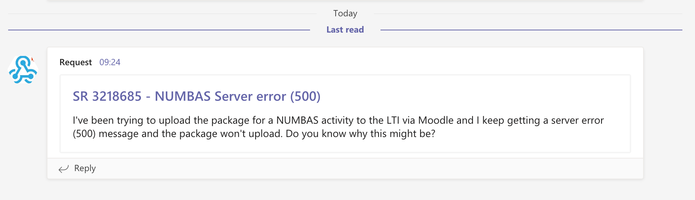

# CASDTT - Creating a message to a MS Teams channel 

CASDTT is a command line program for posting a message to Microsoft Teams channel.



## Motivation

Yes, you can create a message in a Teams channel using Microsoft Teams application by clicking and copy-and-pastings just fine, but...

* I use [dwm](https://dwm.suckless.org/) (dynamic window manager) on Fedora
* `casdtt` allows me to run just 1 command from the terminal
* it gives me a good reason to use Rust to write a small program

## Usage

```console
❯ casdtt -h
casdtt 0.1.1
Post a CASD request to a Teams channel

USAGE:
    casdtt [FLAGS] [OPTIONS] --id <id> --title <title>

FLAGS:
    -d, --debug      Activate debug mode
    -h, --help       Prints help information
    -V, --version    Prints version information

OPTIONS:
    -i, --id <id>              Service Desk request number
    -s, --summary <summary>    Summary of request
    -t, --title <title>        Title to display on Teams's message
```

Example:

```console
❯ casdtt -t 32186685 -t 'NUMBAS Server error (500)' \
-s "I've been trying to upload the package for a NUMBAS activity to the LTI via Moodle and I keep getting a server error (500) message and the package won't upload. Do you know why this might be?"
```

## Installation

Precompile binaries are not available.

For Ruster:

```console
❯ git clone https://github.com:kenno/casdtt
❯ cd casdtt
❯ cargo install --path .
```

## License

MIT
